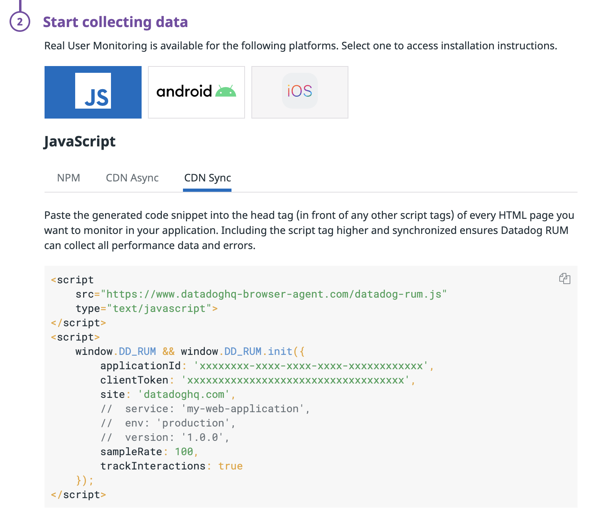

This lab uses a docker version of a fake ecommerce website called "StoreDog". 

1. To get started with RUM, we need to set up a Datadog RUM application. First, navigate to the [RUM Applications](https://app.datadoghq.com/rum/list) section of your Datadog account.
2. Click the **New Application** button.
3. Enter a name for the application. You can use `StoreDog` or whatever you prefer for your site.
4. Click the **Generate Client Token** button.
5. You will see options for integrating on different platforms. We are integrating on the web using JavaScript, so ensure that **JS** is selected.
6. If you are using NPM to manage dependencies for your project front end, you can integrate RUM using the `@datadog/browser-rum` package. However, here we are just going to add the JavaScript inline, so select the `CDN Sync` tab:
    
7. Back in the lab platform, use the `IDE` tab (it may take a few seconds to load) to navigate to our front end code. The file is located at `store-frontend-instrumented-fixed/store-frontend/app/views/layouts/application.html.erb`{{open}}. This Ruby file is the main template for our application. By integrating the RUM script here, it will be available throughout our application.
8. You'll see that we have already integrated the RUM script in the front end and set the initialization arguments. (The code block starts with `if (window.DD_RUM)`. This may look slightly different than the code snippet from the Datadog Javascript bundle example but works the same way)
9. In this lab, we are setting the `applicationId` and `clientToken` using environment variables:
    1. Copy the `applicationId` from the RUM page and assign it to `DD_APPLICATION_ID` in the terminal like: `export DD_APPLICATION_ID=xxxxxxxxxxxxxxxxxxxxxxxxxxxxxxxxxxx`
    2. Copy the `clientToken` from the RUM page and assign it to `DD_CLIENT_TOKEN` in the terminal like: `export DD_CLIENT_TOKEN=xxxxxxxxxxxxxxxxxxxxxxxxxxxxxxxxxxx`
10. To verify, when you run this command, you should see YOUR keys displayed in the terminal: `echo $DD_CLIENT_TOKEN $DD_APPLICATION_ID`{{execute}}
11. Start our StoreDog app using `docker-compose up -d`{{execute}}. Docker will pick up the environment variables you set in the host and pass them along to the containers. You should see the app starting.