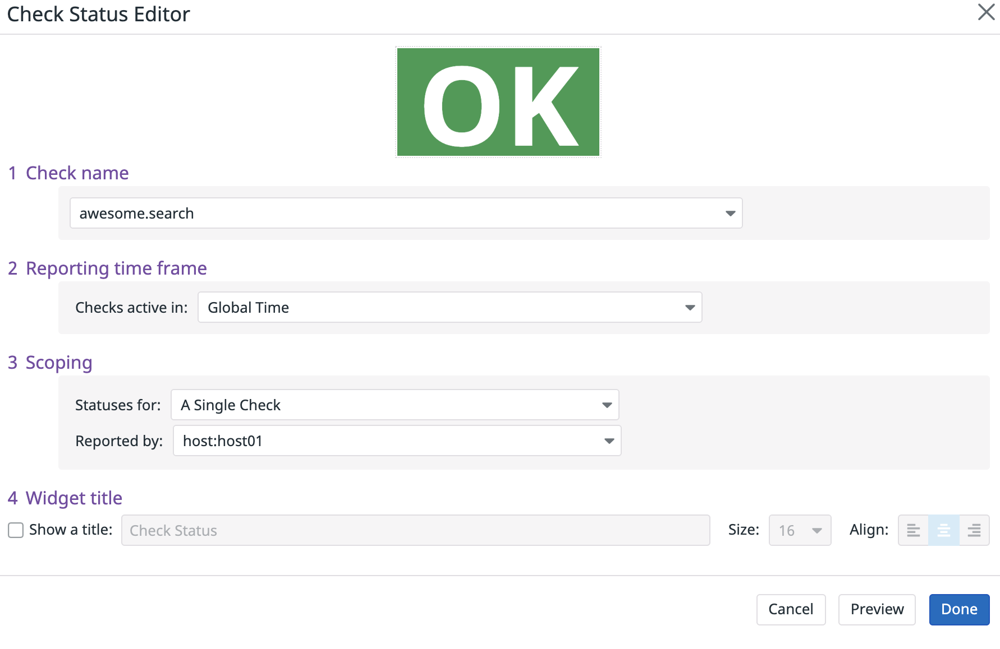

The last step is to actually visualize the results of the check. Open the Datadog web interface, navigate to [Dashboards](https://app.datadoghq.com/dashboard/lists#) and click `New Dashboard`, then set up a *screenboard* with a [Check Status widget](https://docs.datadoghq.com/graphing/widgets/check_status/#pagetitle) based on the `awesome.search` check. (`Edit Widgets` > drag `Check Status` onto the board)

When building the widget, your settings should look like this:
    

Make sure to set the "Check name" in the first section and the "Reported by" in the third.

After adding the check to your dashboard, it should be "OK". Remember, we are checking [https://example.com/](https://example.com/) for the text "Example Domain", which exists.

You can try editing your config file to change the `search_string` or `url` options such that the check fails (like setting the `search_string` to "Datadog Integrations") `conf.yaml`{{open}}

Make sure to restart the agent so the changes take effect:
```
systemctl restart datadog-agent
```{{execute}}

You should see the check on the dashboard  ("WARN") within 5 minutes.

You now have your integration successfully reporting to Datadog.

Run `grademe`{{execute}} to mark this course as complete before moving on to the course wrap-up.